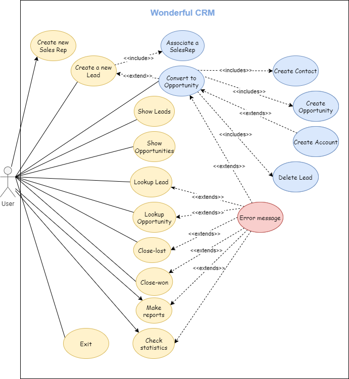
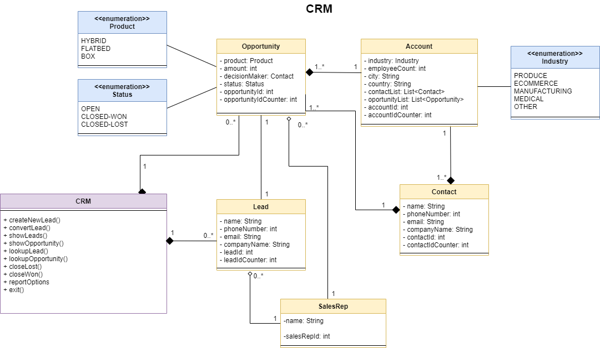

# OPP-Homework-Unit-2

## WARNING 

**To run the test you must to comment the CrmUnit3Application** :warning:

Welcome to the best CRM in the world!

Before starting, we want to tell you how our project is organized.

We have created five principal classes (src/main/java/com/ironhack.CRMunit3/model/): 
* Lead: the person we want to pervert
* Contact: the contact information of the person we have perverted
* Opportunity: the information of what will we probably sell
* Account: the company of the person we have perverted
* SalesRep: the person responsible for sales

And we have created five repositories with their methods and queries (src/main/java/com/ironhack.CRMunit3/repository/):
* AccountRepository
* ContactRepository
* LeadRepository
* OpportunityRepository
* SalesRepRepository

All of them contain an attribute "id" that autoincrements with every instance created. Also, a constructor and only getters, no setters: we didn't want our info to be edited after creation (except the Opportunity status)

Some of those classes' attributes were Enums, so we created them and added to the folder src/main/java/com/ironhack/enums/
* Industry
* Product
* Status

The principal methods have been written in three separated "utils" classes (src/main/java/com/ironhack.CRMunit3/utils/):
* ScanInfo: these class methods ask the user for an individual input. You will find methods such as "askName", "askQuantity",...
* Checker: as their name say, these methods check that the user input is correct. Your name cannot contain numbers, sorry.
* Command: here we read the main commands of the program ("new lead", "show opportunities",...) and calls the appropiate method (newLead(), showOpportunities(),...) from the same class.
* Math: here we have the calculation of the median.
* Colors: this class contains all colors of the console. 
* Sound: this class contains all sounds of the console.

And, of course, to execute our program, you have to run CrmUnit3Application. We have created `wonderful_crm.sql` with data to test our program (please be kind :D). If you want to run test, we have created the `wonderful_crm_test.sql` without data.

## Let's begin!

When you run The Best CRM In The World, the following menu will appear:

    What do you want to do?:
    - new sales rep
    - new lead
    - convert \opportunityId\
    - show \objectInPlural\
    - lookup \object\ \id\
    - close-lost \opportunityId\
    - close-won \opportunityId\
    - report \object\ by \attribute\
    - statistics
    - exit

Those are all the commands you can use, they are all case insensitive and were made error-proof. This menu will show until you type "exit" (or any phrase beggining with exit :P).

From this moment, the program works as requested by the OPP Homework. Remember that you cannot convert a Lead to Opportunity if it doesn't exists, and all of those obvious things. But don't worry, we have managed all exceptions so you can act as a dumb monkey if you want c: have fun!

The command report \object\ by \attribute\ allows you to do the following reports. The command statistics display a menu and allows you to choose between Max, Min, Median and Mean from EmployeeCount, Quantity and Opportunities per account.
The following table specifies the commands you can do:

| Command | Description |
| --- | --- |
| `Report Lead by SalesRep` | A count of Leads by SalesRep |
| `Report Opportunity by SalesRep` | A count of all Opportunities by SalesRep |
| `Report CLOSED-WON by SalesRep` | A count of all CLOSED_WON Opportunities by SalesRep |
| `Report CLOSED-LOST by SalesRep` | A count of all CLOSED_LOST Opportunities by SalesRep |
| `Report OPEN by SalesRep` | A count of all OPEN Opportunities by SalesRep |
| --- | --- |
| `Report Opportunity by product` | A count of all Opportunities by product  |
| `Report CLOSED-WON by product` | A count of all CLOSED_WON Opportunities by product  |
| `Report CLOSED-LOST by product` | A count of all CLOSED_LOST Opportunities by product |
| `Report OPEN by product` | A count of all OPEN Opportunities by product |
| --- | --- |
| `Report Opportunity by Industry` |A count of all Opportunities by industry  |
| `Report CLOSED-WON by Industry` | A count of all CLOSED_WON Opportunities by industry |
| `Report CLOSED-LOST by Industry` | A count of all CLOSED_LOST Opportunities by industry  |
| `Report OPEN by Industry` | A count of all OPEN Opportunities by industry |
| --- | --- |
| `Mean EmployeeCount` | The mean employeeCount  |
| `Median EmployeeCount` |The median employeeCount  |
| `Max EmployeeCount` | The maximum employeeCount |
| `Min EmployeeCount` |The minimum employeeCount   |
| --- | --- |
| `Mean Quantity` | The mean quanitity of products |
| `Median Quantity` | The median quanitity of products order  |
| `Max Quantity` | The maximum quanitity of products order |
| `Min Quantity` | The minimum quanitity of products order  |
| --- | --- |
| `Mean Opps per Account` | The mean number of Opportunities associated with an Account  |
| `Median Opps per Account` | The median number of Opportunities associated with an Account  |
| `Max Opps per Account` | The maximum number of Opportunities associated with an Account |
| `Min Opps per Account` | The minimum number of Opportunities associated with an Account  |

## TDD

Yes, we also had to do some testing. We have to confess that this wasn't fun, but our program now is robust as a rock! (We can discuss if it was worth it later...)

The "Test" classes are inside src/test/java/com.uronhack.CRMunit3/:
* AccountRepositoryTest
* LeadRepositoryTest
* OpportunityRepositoryTest
* ScanInfoTest
* CheckerTest

## UML DIAGRAMS

